# Diagrama ER — Social Veículos

> Gerado automaticamente a partir de `apps/api/models.py`
> Última atualização: 2026-06-21

## Diagrama Completo

```mermaid
erDiagram
    loja {
        string id PK
        string nome
        string slug UK
        string cnpj UK
        string logo_url
        string telefone
        string whatsapp
        string email
        string endereco
        string cidade
        string estado
        string cep
        bool verificada
        bool ativa
        datetime created_at
        datetime updated_at
    }

    usuario {
        string id PK
        string nome
        string email UK
        string telefone
        string senha_hash
        string avatar_url
        enum papel
        bool ativo
        string mfa_secret
        bool mfa_ativo
        datetime created_at
        datetime updated_at
    }

    membro_loja {
        string id PK
        string usuario_id FK
        string loja_id FK
        enum papel
        text modulos
        bool ativo
        datetime created_at
    }

    sessao {
        string id PK
        string usuario_id FK
        string refresh_token UK
        string ip
        string user_agent
        bool revogada
        datetime expira_em
        datetime created_at
    }

    catalogo_marca {
        int id PK
        string nome UK
        string logo_url
        bool ativa
    }

    catalogo_modelo {
        int id PK
        int marca_id FK
        string nome
        bool ativo
    }

    veiculo {
        string id PK
        string loja_id FK
        string placa
        string marca
        string modelo
        string versao
        int ano_fabricacao
        int ano_modelo
        int km
        string cor
        enum cambio
        enum combustivel
        string tipo
        int portas
        float preco_venda
        float preco_custo
        enum status
        bool publicado_marketplace
        text descricao
        text opcionais
        datetime created_at
        datetime updated_at
    }

    midia {
        string id PK
        string veiculo_id FK
        enum tipo
        string url
        int ordem
        datetime created_at
    }

    cliente_pf {
        string id PK
        string loja_id FK
        string usuario_id FK
        string nome
        string cpf
        string cnpj
        string rg
        datetime data_nascimento
        string telefone
        string email
        float renda_mensal
        string cep
        string endereco
        string numero
        string bairro
        string cidade
        string estado
        text observacoes
        text tags
        datetime created_at
        datetime updated_at
    }

    lead {
        string id PK
        string loja_id FK
        string cliente_id FK
        string veiculo_id FK
        enum etapa
        enum origem
        float valor_proposta
        text observacoes
        datetime created_at
        datetime updated_at
    }

    negociacao {
        string id PK
        string lead_id FK
        string veiculo_id FK
        float valor_proposta
        float valor_entrada
        int parcelas
        text observacoes
        datetime created_at
        datetime updated_at
    }

    favorito {
        string id PK
        string usuario_id FK
        string veiculo_id FK
        datetime created_at
    }

    publicacao_b2b {
        string id PK
        string loja_id FK
        string veiculo_id FK
        string autor_id FK
        text conteudo
        float valor_repasse
        bool ativa
        datetime created_at
        datetime updated_at
    }

    comentario {
        string id PK
        string publicacao_id FK
        string autor_id FK
        text conteudo
        datetime created_at
    }

    curtida {
        string id PK
        string publicacao_id FK
        string usuario_id FK
        datetime created_at
    }

    conversa {
        string id PK
        enum tipo
        string loja_id FK
        string cliente_id FK
        string veiculo_id FK
        string loja_a_id FK
        string loja_b_id FK
        bool ativa
        datetime created_at
        datetime updated_at
    }

    mensagem {
        string id PK
        string conversa_id FK
        string autor_id FK
        text conteudo
        bool lida
        datetime created_at
    }

    lancamento_financeiro {
        string id PK
        string loja_id FK
        enum tipo
        string descricao
        float valor
        datetime data
        string veiculo_id FK
        text observacoes
        datetime created_at
    }

    comissao {
        string id PK
        string loja_id FK
        string vendedor_id FK
        string veiculo_id FK
        float valor_venda
        float percentual
        float valor_comissao
        bool pago
        datetime created_at
    }

    plano {
        string id PK
        string nome
        text descricao
        float preco_mensal
        text modulos_incluidos
        bool ativo
        datetime created_at
    }

    assinatura {
        string id PK
        string loja_id FK
        string plano_id FK
        enum status
        datetime inicio
        datetime fim
        datetime created_at
    }

    pagamento {
        string id PK
        string assinatura_id FK
        float valor
        enum status
        string referencia
        datetime data_pagamento
        datetime created_at
    }

    modulo_habilitado {
        string id PK
        string loja_id FK
        string nome_modulo
        bool ativo
        datetime created_at
    }

    log_auditoria {
        string id PK
        string loja_id
        string ator_id
        string ator_nome
        string acao
        string entidade
        string entidade_id
        text detalhes
        string ip
        datetime created_at
    }

    %% ── Relationships ──
    loja ||--o{ membro_loja : "tem"
    usuario ||--o{ membro_loja : "pertence a"
    usuario ||--o{ sessao : "tem"

    catalogo_marca ||--o{ catalogo_modelo : "tem"

    loja ||--o{ veiculo : "possui"
    veiculo ||--o{ midia : "tem"
    veiculo ||--o{ favorito : "recebe"
    usuario ||--o{ favorito : "faz"

    loja ||--o{ cliente_pf : "cadastra"
    loja ||--o{ lead : "gerencia"
    cliente_pf ||--o{ lead : "gera"
    lead ||--o{ negociacao : "evolui para"

    loja ||--o{ publicacao_b2b : "publica"
    publicacao_b2b ||--o{ comentario : "recebe"
    publicacao_b2b ||--o{ curtida : "recebe"

    loja ||--o{ conversa : "participa"
    conversa ||--o{ mensagem : "contem"

    loja ||--o{ lancamento_financeiro : "registra"
    loja ||--o{ comissao : "paga"

    loja ||--o{ assinatura : "assina"
    plano ||--o{ assinatura : "define"
    assinatura ||--o{ pagamento : "gera"
    loja ||--o{ modulo_habilitado : "habilita"
```

## Resumo das Entidades

| Grupo | Entidades | Quantidade |
|-------|-----------|:----------:|
| **Tenancy & Auth** | loja, usuario, membro_loja, sessao | 4 |
| **Catálogo** | catalogo_marca, catalogo_modelo | 2 |
| **Estoque** | veiculo, midia | 2 |
| **CRM** | cliente_pf, lead, negociacao | 3 |
| **Social B2B** | favorito, publicacao_b2b, comentario, curtida | 4 |
| **Chat** | conversa, mensagem | 2 |
| **Financeiro** | lancamento_financeiro, comissao | 2 |
| **Assinaturas** | plano, assinatura, pagamento, modulo_habilitado | 4 |
| **Auditoria** | log_auditoria | 1 |
| **Total** | | **24** |

## Índices Criados

| Tabela | Índice | Colunas |
|--------|--------|---------|
| usuario | ix_usuario_email | email |
| membro_loja | ix_membro_loja_id | loja_id |
| sessao | ix_sessao_usuario, ix_sessao_refresh | usuario_id, refresh_token |
| catalogo_modelo | ix_modelo_marca | marca_id |
| veiculo | ix_veiculo_loja, ix_veiculo_placa, ix_veiculo_marketplace, ix_veiculo_status, ix_veiculo_marca_modelo | loja_id, placa, publicado_marketplace, status, marca+modelo |
| midia | ix_midia_veiculo | veiculo_id |
| cliente_pf | ix_cliente_loja, ix_cliente_cpf, ix_cliente_telefone | loja_id, cpf, telefone |
| lead | ix_lead_loja, ix_lead_etapa, ix_lead_cliente | loja_id, etapa, cliente_id |
| negociacao | ix_negociacao_lead | lead_id |
| favorito | ix_favorito_veiculo, ix_favorito_usuario | veiculo_id, usuario_id |
| publicacao_b2b | ix_pub_b2b_loja | loja_id |
| comentario | ix_comentario_pub | publicacao_id |
| curtida | ix_curtida_pub | publicacao_id |
| conversa | ix_conversa_loja, ix_conversa_cliente | loja_id, cliente_id |
| mensagem | ix_mensagem_conversa | conversa_id |
| lancamento_financeiro | ix_lancamento_loja, ix_lancamento_data | loja_id, data |
| comissao | ix_comissao_loja, ix_comissao_vendedor | loja_id, vendedor_id |
| assinatura | ix_assinatura_loja | loja_id |
| pagamento | ix_pagamento_assinatura | assinatura_id |
| modulo_habilitado | ix_modulo_loja | loja_id |
| log_auditoria | ix_audit_loja, ix_audit_ator, ix_audit_acao, ix_audit_data | loja_id, ator_id, acao, created_at |
